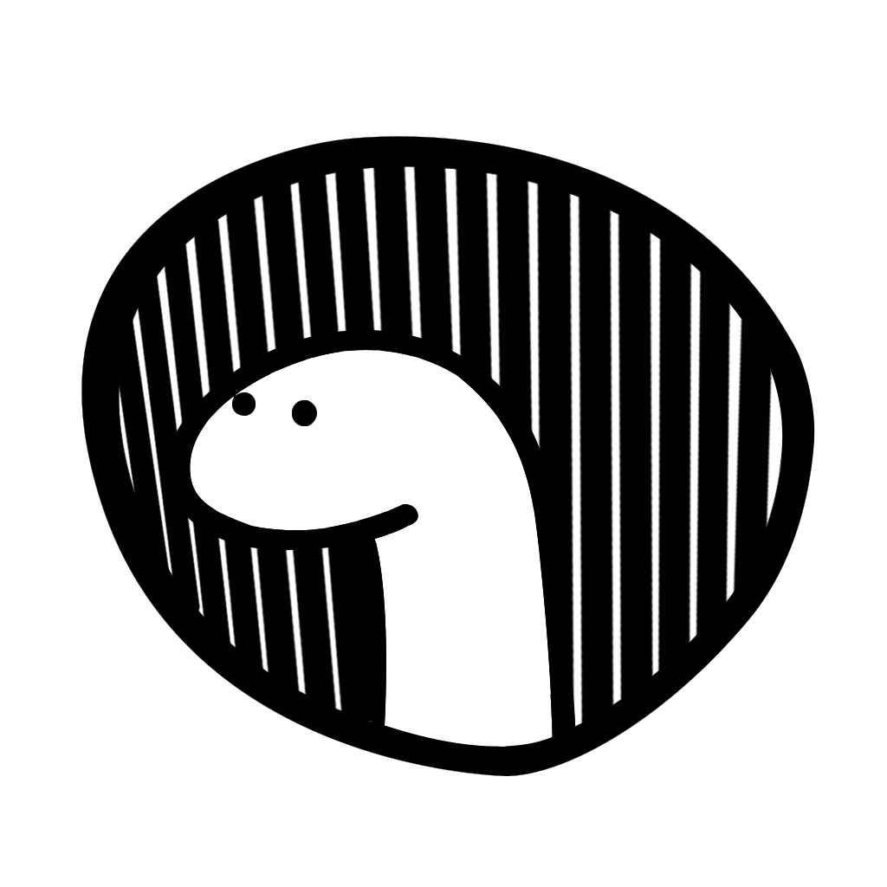

# Gaukrenn 2024 - Backend

```
deno task start
```

## KV DB

Teams: `team:<id>` -> `string`

Challenge: `challenge:<id>` -> `string`

Scores: `score:<teamId>:<challengeId>` -> `number`

The total score of a team is the sum of all scores for that team.

<div style="display: flex; align-items: center; gap: 8px;">
    
    <p style="font-size: 24px;">Built with Deno and Hono ❤</p>
</div>
